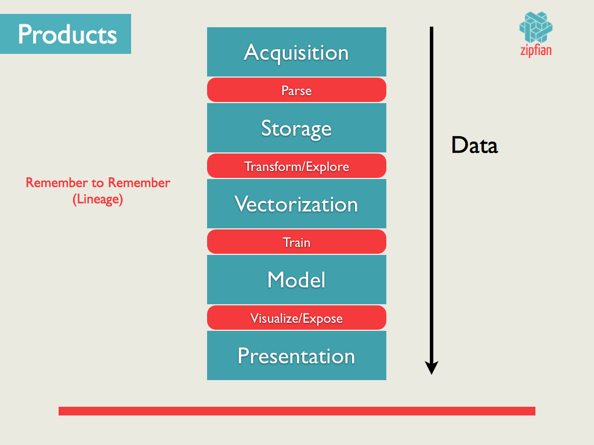

## Overview

### Today, we are going to build an algorithm to try and find that crazy higgs-boson particle.

Using data from the Large Hadron Collider / CERN, the ATLAS experiment has recently observed a signal of the Higgs boson decaying into two tau particles, but this decay is a small signal buried in background noise.  Your task is to classify events into "tau tau decay of a Higgs boson" versus "background".
 
This data is provided as a part of an active Kaggle competition, where **13k* is up top for the winning team (1k* reserved to throw a party).  If yall win, the money is split up equally among your team members (or watever your team agrees to).

##### Below is a link to the official rules and data download page.
http://www.kaggle.com/c/higgs-boson  
Make sure you read the directions for yourself before you start modeling like a chicken with it's head cutoff.  In addition, if you are stuck or having problems with your data or model, the official contest [forum](http://www.kaggle.com/c/higgs-boson/forums) is a great place to start troubleshooting.

An example of what your submission file should look like. This submission file you is the file you will upload to kaggle.com and it will return back your score.

| EventId        | RankOrder    | Class  |
| ------------- |:-------------:| -----:|
|350000 | 485644 | b
|350001 | 345319 | s
|350002 | 232167 | b
|350003 | 126067 | b

### Techniques 

This sprint we be an opportunity to work in groups to apply everything you learned this week to a real world dataset. We will be getting some experience with the larger machine learning pipeline.

This will be an exercise in model evaluation, comparison, tuning, etc. Try to use models and algorithms that we have covered and only once you have exhausted everytihng move on to new unknown algorithms. Here are some things you should experiment and try:

* Feature selection
* Grid search hyperparamter tuning
* Model comparison/evaluation

__And Remember, always CROSS VALIDATE__

### Feature engineering/selection

Feature extraction/engineering is one of the more subjective aspects of ML and often depends on experimentation and domain knowledge.  It is here that we will learn its art. 

Before we can begin any analysis, we will first construct a data pipeline to streamline our analysis.  Since we will be experimenting with many different features/techniques, it is essential to systematize our approach.  This way we can easily compare what works and what doesn't!

* [Chi-Squared](http://nlp.stanford.edu/IR-book/html/htmledition/feature-selectionchi2-feature-selection-1.html) (and using correlation) feature selection
* [forward and backward feature selection](http://www.cse.msu.edu/~cse802/Feature_selection.pdf)
